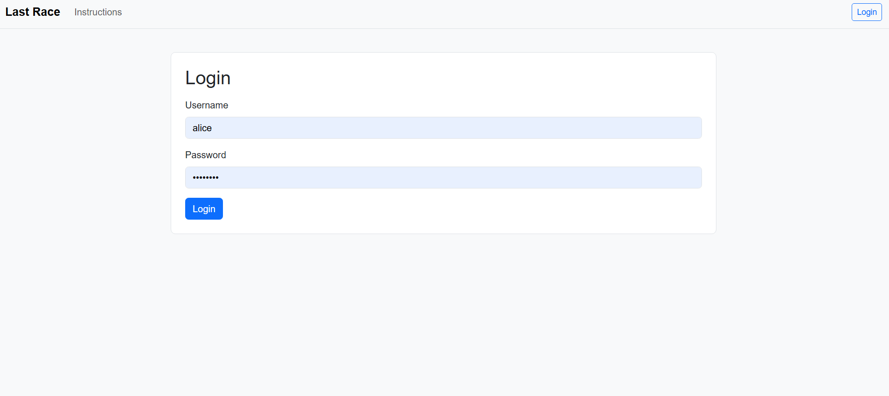
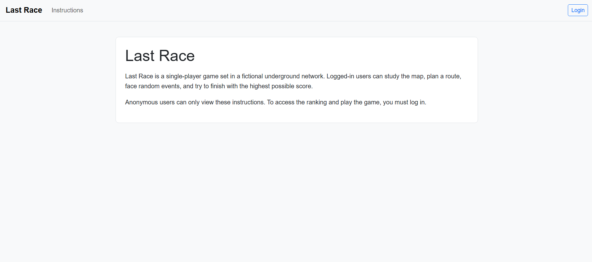
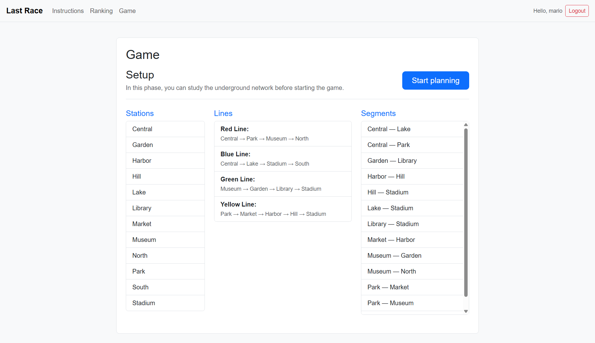
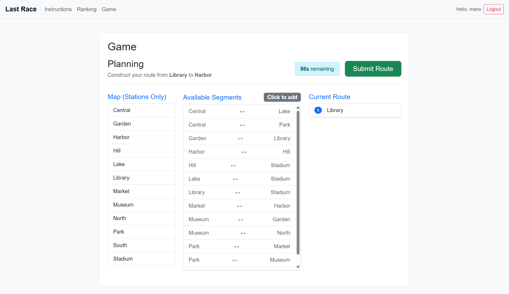
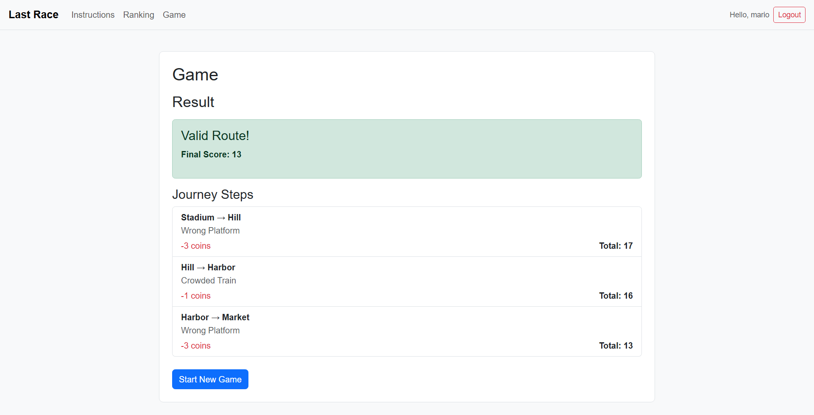
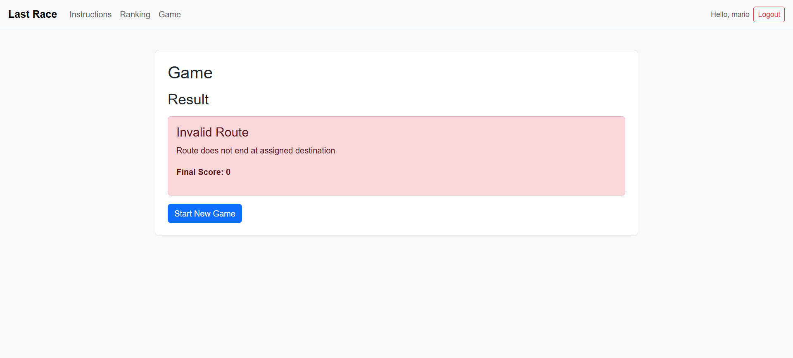

# Exam: "Last Race"
## Student: s356274 Shaikh Abdul Rahim Abdul Wahab 

## React Client Application Routes

- Route `/`: The Instructions page detailing the game mechanics, accessible by all users.
- Route `/login`: The Login page where users can authenticate.
- Route `/ranking`: Displays a leaderboard of users and their best scores. Requires authentication.
- Route `/game`: The core game page featuring the three phases (Setup, Planning, Execution). Requires authentication.

## API Server

- GET `/api/health`
  - response body: `{ message: 'Server is running' }`
- POST `/api/sessions`
  - request body: `{ username: 'mario', password: 'password' }`
  - response body: `{ id: 1, username: 'mario' }`
- GET `/api/sessions/current`
  - response body: `{ id: 1, username: 'mario' }`
- DELETE `/api/sessions/current`
  - response body: `{ message: 'Logged out' }`
- GET `/api/ranking`
  - response body: `[{ username: 'mario', best_score: 26 }, ...]`
- GET `/api/network`
  - response body: `{ stations: [...], lines: [...], lineStations: [...], segments: [...] }`
- GET `/api/events`
  - response body: `[{ id: 1, description: '...', type: 'POSITIVE', effect: 4 }, ...]`
- GET `/api/segments`
  - response body: `[{ id: 1, station1_id: 1, station2_id: 2 }, ...]`
- GET `/api/game/start`
  - response body: `{ startStation: { id: 1, name: '...' }, destinationStation: { id: 5, name: '...' } }`
- POST `/api/game/execute`
  - request body: `{ route: [1, 2, 3], start_station_id: 1, destination_station_id: 3 }`
  - response body: `{ isValid: true, finalScore: 18, steps: [...], reason: '' }`
- POST `/api/games`
  - request body: `{ start_station_id: 1, destination_station_id: 3, final_score: 18, is_valid: true }`
  - response body: `{ id: 5 }`

## Database Tables

- Table `users` - contains user accounts (`id`, `username`, `password_hash`, `salt`)
- Table `stations` - contains metro station data (`id`, `name`)
- Table `lines` - contains metro line data (`id`, `name`, `color`)
- Table `line_stations` - maps stations to lines (`line_id`, `station_id`, `position`)
- Table `segments` - contains connection pairs between stations (`id`, `station1_id`, `station2_id`)
- Table `events` - contains random events for the execution phase (`id`, `description`, `type`, `effect`)
- Table `games` - contains historical game records (`id`, `user_id`, `start_station_id`, `destination_station_id`, `final_score`, `is_valid`, `played_at`)

## Main React Components

- `App` (in `App.jsx`): Main router and layout component handling navigation and user session state.
- `ProtectedRoute` (in `components/ProtectedRoute.jsx`): Wrapper to protect routes requiring authentication.
- `InstructionsPage` (in `pages/InstructionsPage.jsx`): Displays game rules.
- `LoginPage` (in `pages/LoginPage.jsx`): Handles the user login form.
- `RankingPage` (in `pages/RankingPage.jsx`): Fetches and displays the top scores ranking.
- `GamePage` (in `pages/GamePage.jsx`): Central game logic containing the Setup, Planning, and Result phases.

## Screenshots

## Users Credentials

- `mario`, `password`
- `luca`, `password`
- `anna`, `password`

## Use of AI Tools

I used AI tools to assist with setting up boilerplate React and Express code, debugging React state and effects, styling the layout using Bootstrap grids, and refining the graph validation algorithm to meet the exam constraints.
